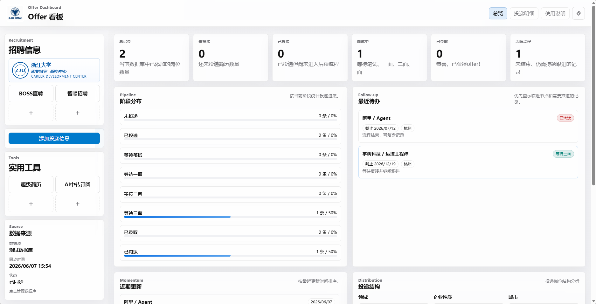



  
  <h1>ZJU Offer Dashboard</h1>
  
<strong>本地运行、下载即用的 Offer 管理看板</strong>

  
帮你管理投递进度、流程节点、待办事项和多数据库记录。

  

## 项目简介

ZJU Offer Dashboard 是一个本地运行的求职投递管理工具，适合用来统一管理秋招、春招、实习等不同阶段的投递记录。
- 无需任何注册流程，开箱即用
- 数据保存在你自己的电脑里，避免信息泄露
- 多系统支持

## 核心功能

| 功能 | 说明 |
| --- | --- |
| 本地优先 | 所有数据保存在本地 SQLite 中，不依赖远程服务 |
| 多库管理 | 支持创建、切换、删除不同数据库 |
| 看板视图 | 支持总览、明细、阶段分布、近期待办等视图 |

## 适合谁

- 想把秋招、春招、实习记录放到一个地方的人
- 不想来回切 Excel、备忘录、聊天记录的人
- 希望数据只保留在自己电脑里的人
- 想把项目直接发给别人，对方也能双击就用的人

## 一眼看懂

| 模块 | 作用 |
| --- | --- |
| `Open Offer Dashboard.exe` | Windows 一键启动 |
| `Open Offer Dashboard.app` | macOS 一键启动 |
| `Open Offer Dashboard.desktop` | Linux 一键启动 |
| `src/web/` | 前端页面 |
| `src/server/` | 本地服务 |
| `data/` | 你的数据库和本地数据 |
| `runtime/` | Node 运行时缓存，首次启动需要时自动下载 |

## 使用方式

### 第一次使用

1. 从 GitHub 下载项目压缩包
2. 解压到任意你想保存的位置
3. 双击你系统对应的启动入口

| 系统 | 启动文件 |
| --- | --- |
| Windows | `Open Offer Dashboard.exe` |
| macOS | `Open Offer Dashboard.app` |
| Linux | `Open Offer Dashboard.desktop` |

### 双击后会自动完成什么

1. 自动识别你的系统和 CPU 架构
2. 优先检测系统是否已安装 Node.js 24 或更新版本
3. 如果没有可用 Node，则自动下载并校验对应平台的官方 Node 运行时
4. 在后台启动本地服务
5. 打开启动页面
6. 服务准备完成后自动在当前标签页进入 Dashboard

如果浏览器没有自动跳转，可以手动访问：

`http://127.0.0.1:4782`

## 后续怎么用

以后每次使用都很简单：

1. 打开项目文件夹
2. 双击对应系统的启动入口
3. 等待网页自动打开
4. 直接在页面里继续新增、编辑、切换数据库

## 数据在哪里

你的数据都保存在项目根目录的 `data/` 文件夹里。

常见文件包括：

- `data/database-config.json`
- `data/*.sqlite3`
- `data/launcher.log`

如果你要备份，只需要备份整个 `data/` 文件夹。

## 常见问题

### 1. 双击后没打开 Dashboard

先等几秒，首次启动可能需要准备运行时。

如果还是没有打开，可以手动访问：

`http://127.0.0.1:4782`

Windows 还可以查看：

`data/launcher.log`

### 2. 为什么第一次会稍微慢一点

因为第一次可能需要联网下载对应平台的 Node 运行时。下载完成后会缓存在 `runtime/` 目录，之后启动会直接复用。

如果你的系统已经安装 Node.js 24 或更新版本，首次启动会直接使用系统 Node，不会下载运行时。

### 3. 我的数据会上传到外网吗

不会。这个项目是本地运行、本地存储的。

  Built for local-first job tracking · ZJU Offer Dashboard

